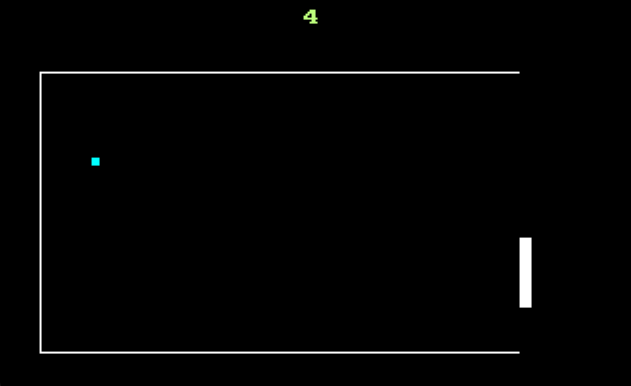

#  8086 Assembly Pong Game

A classic, single-player Pong game written in **8086 Assembly Language** using **VGA Mode 13h** (`320x200` graphics). This project demonstrates low-level graphics, BIOS interrupts, keyboard input, collision detection, score handling, and game loop logic in a DOS environment.



##  Features

- **320x200 pixel graphics**
- **Player racket moves up/down with W/S**
- **Ball movement and bouncing**
- **Collision detection**
- **Score display**
- **Win condition at 30 points**
- **Random ball color change on racket hit**

##  Requirements

To run this project, you need:

- **DOSBox**
- An 8086 assembler such as **TASM** or **MASM** or **emu8086**
- The compiled game file, for example: `pong.com`

##  Running the Game in DOSBox

If your compiled file is inside a folder on your computer, open DOSBox and run:
```dos
mount c C:\path\to\your\folder
C:
pong.com
```

## Controls
W or w: Move Racket Up
S or s: Move Racket Down
Q or q: Exit Game

## Next Improvements

- Restart Logic: Implement a listener on the Game Over screen (e.g., “Press R to Restart”) to reset variables and loop back to the start without exiting.
- Winning Screen
- Random Ball Placement and Direction each time the game starts.
- Menu Options: A menu that the player can choose the difficulty of the game and choose the winning point (default is 30) and start the game.
- PC Speaker Sound: Add a “beep” sound effect whenever the ball hits a wall or the racket.
- Increase Difficulty: Make the ball move faster every 5 points scored to increase the challenge.
- High Score: Save the highest score to a file using DOS file interrupts so it persists after closing the game.


## Enjoy classic Pong assembly challenge!
